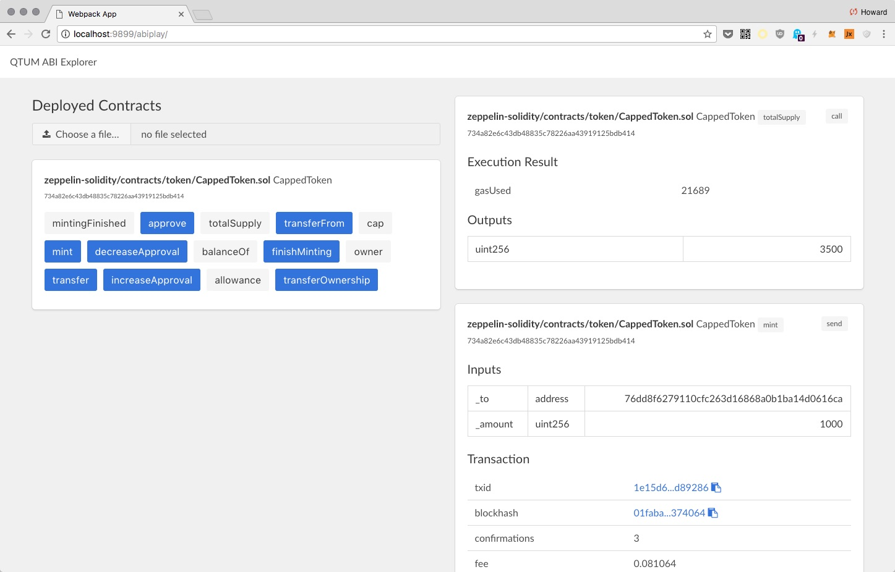
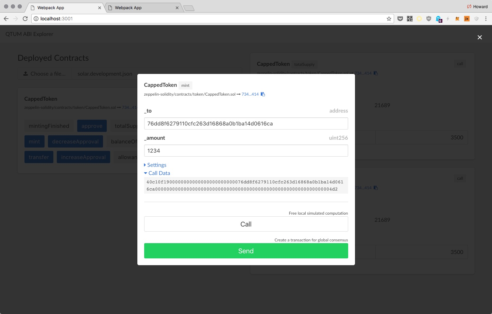

ABIPlayer is a DApp that provides UI to interact with contracts deployed with [solar](https://github.com/qtumproject/solar). You can use this UI to send/call methods of contracts.

This is what the ABI player looks like when an ERC20 token is loaded:



The gray buttons are readonly methods (call only). The blue buttons support both send and call.

To use a method:



# To Develop

Clone repo:

```
git clone https://github.com/qtumproject/qtumjs-abiplayer.git my-project
```

Install dependencies:

```
yarn
```

Start Neutrino dev server on port 3000:

```
PORT=3000 yarn start
```

Open http://localhost:3000, and edit `src/index.tsx` for live-reload.

For styling, edit `src/index.css`.

Edit the [html](https://github.com/hayeah/neutrino-react-ts-boilerplate/blob/727d23b260935edd7a3b2c56d8e05ef616cec31c/.neutrinorc.js#L10) options to customize the HTML template. See [html-webpack-template](https://github.com/jaketrent/html-webpack-template/tree/624dd3931cc2ffaeed03962b25c61af81c2997e2#basic-usage).

## QTUMD Regtest Mode

For development purposes, run qtumd in regtest mode:

```
docker run -it --rm \
  --name myapp \
  -v `pwd`:/dapp \
  -p 9899:9899 \
  -p 9888:9888 \
  -p 3889:3889 \
  hayeah/qtumportal
```

## Other Tips

Generating sourcemap may slow down project rebuilding. Webpack provide other sourcemap types that can speed up project building.

In particular, the `eval` sourcemap is quite faster.

```
SOURCEMAP=eval PORT=3000 yarn start
```

See [devtool](https://webpack.js.org/configuration/devtool/#devtool`) for a list of sourcemap types.
